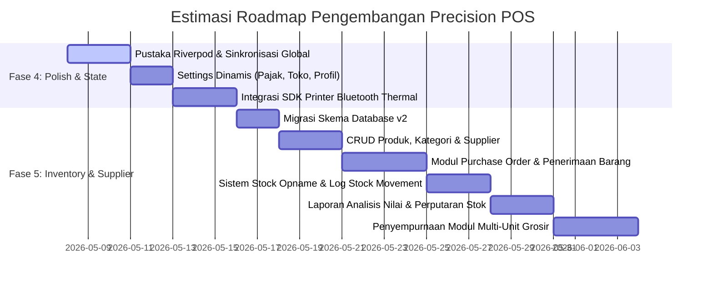

# 📊 Analisis Komprehensif & Detail Project: Precision POS

Selamat datang di laporan analisis mendalam untuk project **Precision POS** (APLIKASI POS dengan AI STICH dan AntiGravity). Laporan ini dibuat secara eksklusif untuk mendokumentasikan status terkini, kualitas arsitektur, potensi utang teknis (*technical debt*), serta peta jalan (*roadmap*) pengembangan untuk pembaruan berikutnya.

---

## 📁 1. Informasi Project & Status Terkini

Aplikasi ini merupakan sistem **Point of Sale (Kasir) Premium** berbasis **Flutter (Dart 3.11+)** yang mengusung filosofi desain **"Architectural Layering" / "The Precision Atelier"**. Konsep visualnya mengutamakan kemewahan tata letak editorial, kebersihan komponen tanpa garis pembatas kaku (*No-Line Philosophy*), serta transisi warna halus (*tonal shifts*).

### ⚙️ Spesifikasi Teknis Inti
*   **Framework Utama:** Flutter SDK
*   **Database Lokal:** SQLite via [sqflite](file:///d:/aplikasi/newFlutter/APLIKASI-POS-dengan-AI-STICH-dan-AntiGravity-/pubspec.yaml#L39) (mendukung fungsionalitas *offline-first*)
*   **Desain Sistem:** Material 3 Custom Palette (Deep Navy `#001E40` & Emerald Green `#006D36`/`#50C878`)
*   **Tipografi:** Inter (via [google_fonts](file:///d:/aplikasi/newFlutter/APLIKASI-POS-dengan-AI-STICH-dan-AntiGravity-/pubspec.yaml#L37))
*   **Visualisasi Data:** [fl_chart](file:///d:/aplikasi/newFlutter/APLIKASI-POS-dengan-AI-STICH-dan-AntiGravity-/pubspec.yaml#L38) (untuk grafik penjualan per jam)
*   **Status Implementasi:** **Fase 1 (Fondasi Data)**, **Fase 2 (Manajemen Order Inti)**, dan sebagian besar **Fase 3 (Reporting, PDF & CSV)** telah berhasil diimplementasikan dengan sangat baik dan terintegrasi dengan database riil.

---

## 🏛️ 2. Analisis Arsitektur Kode & Folder

Aplikasi dirancang dengan arsitektur berlapis (*layered architecture*) yang memisahkan tanggung jawab antara antarmuka (UI), logika bisnis (domain), dan akses data (data/infrastructure). Ini sangat membantu skalabilitas project.

Berikut adalah dekonstruksi arsitektur per folder di dalam [lib/](file:///d:/aplikasi/newFlutter/APLIKASI-POS-dengan-AI-STICH-dan-AntiGravity-/lib):

### A. Lapisan Data & Penyimpanan Lokal (`lib/data/` & `lib/models/`)
*   **[database_helper.dart](file:///d:/aplikasi/newFlutter/APLIKASI-POS-dengan-AI-STICH-dan-AntiGravity-/lib/data/database_helper.dart):** Menggunakan pola *Singleton*. Mengelola siklus hidup database SQLite `precision_pos.db` serta menginisialisasi skema tabel dasar (`products`, `transactions`, `order_items`). File ini juga bertugas melakukan *seeding* produk dummy awal secara otomatis dari file aset lokal `product.json`.
*   **[product_model.dart](file:///d:/aplikasi/newFlutter/APLIKASI-POS-dengan-AI-STICH-dan-AntiGravity-/lib/models/product_model.dart):** Entitas produk dengan struktur data minimalis: `id`, `nama`, `harga`, dan `stok`.
*   **[transaction_model.dart](file:///d:/aplikasi/newFlutter/APLIKASI-POS-dengan-AI-STICH-dan-AntiGravity-/lib/models/transaction_model.dart):** Entitas transaksi yang menampung header struk belanja: `receiptId`, `tanggal`, `totalHarga`, `status` (Completed, Void, Bon), dan optional `customerName`.
*   **[order_item_model.dart](file:///d:/aplikasi/newFlutter/APLIKASI-POS-dengan-AI-STICH-dan-AntiGravity-/lib/models/order_item_model.dart):** Entitas jembatan (*junction table*) antara transaksi dan produk, mencatat `id`, `receiptId`, `productId`, `qty`, dan `subtotal` per produk.

### B. Lapisan Abstraksi Data (`lib/repositories/`)
*   **[product_repository.dart](file:///d:/aplikasi/newFlutter/APLIKASI-POS-dengan-AI-STICH-dan-AntiGravity-/lib/repositories/product_repository.dart):** Mengisolasi operasi database untuk produk, seperti membaca daftar produk dari SQLite, serta melakukan pengurangan dan penambahan stok secara reaktif.
*   **[transaction_repository.dart](file:///d:/aplikasi/newFlutter/APLIKASI-POS-dengan-AI-STICH-dan-AntiGravity-/lib/repositories/transaction_repository.dart):** Logika penyimpanan transaksi kasir yang kompleks. Menggunakan fitur `db.transaction()` (SQLite Transaction) untuk menjamin integritas data (ACID *properties*). Saat transaksi disimpan, stok produk otomatis berkurang. Juga menampung logika *Void* (pembatalan transaksi) yang mengembalikan stok produk ke jumlah semula.

### C. Lapisan Layanan Eksternal & Helper (`lib/services/`)
*   **[api_config.dart](file:///d:/aplikasi/newFlutter/APLIKASI-POS-dengan-AI-STICH-dan-AntiGravity-/lib/services/api_config.dart):** Mengonfigurasi endpoint API backend menggunakan backend Laravel (mengarah ke url ngrok: `https://untonsured-bettina-nonvirulent.ngrok-free.dev/api/v1`). Menggunakan `SharedPreferences` untuk menyimpan token otentikasi.
*   **[api_service.dart](file:///d:/aplikasi/newFlutter/APLIKASI-POS-dengan-AI-STICH-dan-AntiGravity-/lib/services/api_service.dart):** Menangani logika komunikasi HTTP dengan Laravel Backend untuk fungsi otentikasi (`login` dan `register`) yang otomatis menyimpan role pengguna (`delivery`, `admin`, dll) serta detail toko.
*   **[data_export_service.dart](file:///d:/aplikasi/newFlutter/APLIKASI-POS-dengan-AI-STICH-dan-AntiGravity-/lib/services/data_export_service.dart):** Layanan pengekspor data transaksi lokal dari database SQLite menjadi dokumen berformat `.csv` dan membagikannya ke sistem operasi menggunakan package `share_plus`.
*   **[data_import_service.dart](file:///d:/aplikasi/newFlutter/APLIKASI-POS-dengan-AI-STICH-dan-AntiGravity-/lib/services/data_import_service.dart):** Layanan pengimpor file cadangan `.csv` transaksi kasir menggunakan `file_picker` untuk memulihkan transaksi ke database lokal kasir.
*   **[pdf_receipt_service.dart](file:///d:/aplikasi/newFlutter/APLIKASI-POS-dengan-AI-STICH-dan-AntiGravity-/lib/services/pdf_receipt_service.dart):** Desain struk belanja digital kasir berformat PDF 80mm dengan detail item yang dibeli, subtotal, pajak, logo fiktif toko, serta struktur rapi, siap cetak lewat fitur *native print*.
*   **[whatsapp_service.dart](file:///d:/aplikasi/newFlutter/APLIKASI-POS-dengan-AI-STICH-dan-AntiGravity-/lib/services/whatsapp_service.dart):** Layanan fiktif/pengirim tautan WhatsApp kasir.

### D. Lapisan Antarmuka Pengguna (`lib/screens/`, `lib/widgets/`, `lib/theme/`)
*   **[dashboard_screen.dart](file:///d:/aplikasi/newFlutter/APLIKASI-POS-dengan-AI-STICH-dan-AntiGravity-/lib/screens/dashboard_screen.dart):** Antarmuka utama (Tab 0) yang menampilkan performa harian secara *live* dari transaksi SQLite riil (total penjualan, total order), Bento Grid *Quick Actions*, dan daftar transaksi terakhir kasir.
*   **[order_input_screen.dart](file:///d:/aplikasi/newFlutter/APLIKASI-POS-dengan-AI-STICH-dan-AntiGravity-/lib/screens/order_input_screen.dart):** Halaman pembuatan order baru yang responsif, stepper kuantitas (mendukung kuantitas barang bonus), kalkulasi subtotal dan pajak real-time, serta panel checkout.
*   **[payment_method_screen.dart](file:///d:/aplikasi/newFlutter/APLIKASI-POS-dengan-AI-STICH-dan-AntiGravity-/lib/screens/payment_method_screen.dart):** Gerbang pemilihan pembayaran (Cash, QRIS, Bon/Kredit) dengan ringkasan order yang elegan.
*   **[cash_entry_screen.dart](file:///d:/aplikasi/newFlutter/APLIKASI-POS-dengan-AI-STICH-dan-AntiGravity-/lib/screens/cash_entry_screen.dart):** Layar input uang tunai, kalkulator kembalian reaktif, dan shortcut nominal cepat.
*   **[qris_screen.dart](file:///d:/aplikasi/newFlutter/APLIKASI-POS-dengan-AI-STICH-dan-AntiGravity-/lib/screens/qris_screen.dart):** Menampilkan QR Code dinamis dan simulasi konfirmasi pembayaran digital.
*   **[bon_kredit_screen.dart](file:///d:/aplikasi/newFlutter/APLIKASI-POS-dengan-AI-STICH-dan-AntiGravity-/lib/screens/bon_kredit_screen.dart):** Form pengisian data piutang untuk pelanggan grosir, tenggat waktu (*due date*), serta integrasi database.
*   **[payment_success_screen.dart](file:///d:/aplikasi/newFlutter/APLIKASI-POS-dengan-AI-STICH-dan-AntiGravity-/lib/screens/payment_success_screen.dart):** Halaman sukses dengan struk digital yang rapi, tombol WhatsApp Share, Cetak Struk via PDF, dan tombol transaksi baru.
*   **[transaction_history_screen.dart](file:///d:/aplikasi/newFlutter/APLIKASI-POS-dengan-AI-STICH-dan-AntiGravity-/lib/screens/transaction_history_screen.dart):** Tab 1 yang memuat daftar jurnal transaksi lengkap dari SQLite, pengelompokan berdasarkan tanggal, fitur pencarian instan, dan detail transaksi lengkap dengan opsi pembatalan transaksi (*Void*).
*   **[daily_report_screen.dart](file:///d:/aplikasi/newFlutter/APLIKASI-POS-dengan-AI-STICH-dan-AntiGravity-/lib/screens/daily_report_screen.dart):** Tab 2 yang memuat laporan statistik penjualan, grafik analitik harian per jam (*Hourly Performance*) menggunakan `fl_chart`, tabel transaksi detail, serta kartu manajemen data ekspor/impor CSV.
*   **[settings_screen.dart](file:///d:/aplikasi/newFlutter/APLIKASI-POS-dengan-AI-STICH-dan-AntiGravity-/lib/screens/settings_screen.dart):** Tab 3 untuk konfigurasi profil kasir, data toko (tersimpan ke `SharedPreferences`), pengaturan struk, pajak, sinkronisasi data, dan manajemen printer thermal.

---

## 🔍 3. Evaluasi Fitur: Yang Sudah vs Yang Belum

Berdasarkan pemeriksaan mendalam pada kode sumber, berikut adalah audit akurat dari fungsionalitas aplikasi kasir saat ini:

### ✅ Fitur yang SUDAH Berfungsi 100% (Terhubung SQLite)
1.  **Dashboard Terhubung SQLite:** Performa penjualan harian, jumlah transaksi, dan daftar transaksi terakhir sekarang dimuat langsung dari data lokal (bukan fungsionalitas dummy lagi).
2.  **Manajemen Order & Checkout:** Logika penambahan produk via dropdown, kalkulasi subtotal, pajak (8%), total harga, kuantitas reguler, dan bonus bekerja dengan sangat presisi.
3.  **Tiga Metode Pembayaran:**
    *   **Cash:** Input reaktif, kalkulasi kembalian akurat, shortcut tombol nominal cepat berfungsi.
    *   **QRIS:** QR Code dinamis dimuat dengan sukses beserta status simulasi pelunasan.
    *   **Bon / Kredit:** Data kustomer, jatuh tempo, catatan piutang tersimpan dengan sukses ke kolom `customer_name` di database SQLite, menandai transaksi dengan status `Bon`.
4.  **Transaction History & Void:** List transaksi dikelompokkan dengan rapi per hari, pencarian responsif berdasarkan receipt ID, dan fungsi *Void* (pembatalan transaksi) berhasil mengembalikan stok produk yang dibatalkan ke database.
5.  **Daily Reports Riil:** Grafik analitik per jam (*Hourly Performance*) pada daily report screen sekarang merender data penjualan riil dari database SQLite (tidak dummy lagi).
6.  **Ekspor & Impor CSV:** Fungsionalitas ekspor riwayat penjualan harian kasir menjadi file `.csv` serta impor ulang cadangan CSV ke SQLite kasir berfungsi 100%.
7.  **Generate & Cetak PDF Receipt:** Pembuatan dokumen PDF struk belanja 80mm dan menu cetak struk via sistem print sistem operasi sudah berjalan dengan lancar.
8.  **Multi-Role Integration:** Kerangka `MainShell` mendukung perutean berbasis peran (*role-based routing*) di mana akun kasir ber-role `delivery` otomatis diarahkan ke `DeliveryDashboardScreen`.

### ❌ Fitur yang BELUM Fungsional (Butuh Update Segera)
1.  **State Management Global:** Aplikasi belum memiliki pustaka *state management* (seperti `Riverpod` atau `Provider`). Semua pembaruan data mengandalkan `setState` lokal. Akibatnya, saat Anda menyelesaikan transaksi di layar pesanan baru, Tab History dan Tab Laporan tidak otomatis ter-refresh secara langsung tanpa pemicu reload data ulang (stale data).
2.  **Tombol Pengaturan Placeholder:** Di dalam [settings_screen.dart](file:///d:/aplikasi/newFlutter/APLIKASI-POS-dengan-AI-STICH-dan-AntiGravity-/lib/screens/settings_screen.dart), hanya dialog *Store Information* yang sudah terhubung dengan `SharedPreferences`. Tombol lainnya (Profile, Staff Management, Receipt Template, Tax & Service, Data Sync, Printer Setup, About) masih memiliki properti `onTap: null`.
3.  **Integrasi Printer Bluetooth Thermal:** Layanan cetak struk saat ini baru mengandalkan dialog PDF sistem operasi. Belum ada integrasi dengan *hardware* kasir printer bluetooth thermal 58mm/80mm (ESC/POS commands).
4.  **Konfigurasi Pajak Dinamis:** Pajak (Tax 8%) masih di-hardcode secara statis di dalam [order_input_screen.dart](file:///d:/aplikasi/newFlutter/APLIKASI-POS-dengan-AI-STICH-dan-AntiGravity-/lib/screens/order_input_screen.dart#L243). Pengaturan ini seharusnya dinamis dan dapat diubah dari preferensi settings.
5.  **Tombol Share WhatsApp:** Tombol kirim struk ke nomor WhatsApp kustomer di halaman kesuksesan transaksi belum terhubung secara fungsional.

---

## ⚡ 4. Rekomendasi Langkah Update & Refactoring

Untuk meningkatkan mutu aplikasi kasir Precision POS agar siap digunakan pada skenario produksi sesungguhnya, berikut adalah rencana pembaruan terperinci yang direkomendasikan:

### 🌟 Rekomendasi 1: Implementasi State Management (Riverpod)
Gunakan `flutter_riverpod` untuk mengelola *global state* aplikasi kasir. Ini akan menyinkronkan data antar tab secara otomatis.
*   **State Notifier untuk Cart/Order:** Mengelola keranjang belanja kasir secara dinamis di seluruh layar.
*   **State Notifier untuk Transaksi:** Saat transaksi disimpan, notifier akan memicu pembaruan otomatis pada grafik di *DailyReportScreen* dan daftar di *TransactionHistoryScreen* tanpa perlu me-reload halaman dari awal.

### 🌟 Rekomendasi 2: Fungsionalitas Pengaturan Kasir (Settings Screen)
*   **Pajak & Service Charge Dinamis:** Buat pengaturan tarif pajak pada halaman Settings, simpan tarif tersebut di `SharedPreferences`, lalu baca tarif dinamis ini saat kalkulasi di *OrderInputScreen*.
*   **Bluetooth Thermal Printer Setup:** Integrasikan package `print_bluetooth_thermal` atau `blue_thermal_printer` untuk memindai perangkat printer kasir dan menyimpannya sebagai printer default cetak struk fisik secara langsung tanpa melalui konversi PDF sistem operasi.

---

## 📦 5. Blueprint Fase Lanjutan: Fase 5 — Sistem Inventory Grosir

Fase 5 dirancang khusus untuk memperluas jangkauan Precision POS agar dapat dioperasikan oleh toko grosir besar yang memiliki banyak SKU, manajemen pemasok (*supplier*), sistem pembelian barang (*Purchase Order*), pencatatan audit stok fisik (*Stock Opname*), serta jejak riwayat mutasi barang (*Stock Movement Log*).

### 📐 Modul Satuan Multi-unit (Grosir)
Toko grosir membutuhkan fleksibilitas konversi kemasan satuan barang:
*   *Contoh:* Produk **Indomie Goreng** dijual dalam:
    *   Satuan Dasar: **Pcs** (1 pcs)
    *   Satuan Sedang: **Lusin** (12 pcs)
    *   Satuan Besar: **Dus / Karton** (40 pcs)
*   Sistem harus otomatis mengonversi stok masuk saat kulakan dalam satuan **Dus** ke satuan dasar **Pcs** di dalam database, serta menyesuaikan harga jual secara proporsional.

### 💾 Rancangan Skema Migrasi Database (SQLite Versi 2)
Saat Fase 5 dimulai, struktur database SQLite harus dimigrasikan secara aman tanpa merusak data transaksi yang sudah ada. Kita harus meningkatkan versi database dari `1` ke `2` di [database_helper.dart](file:///d:/aplikasi/newFlutter/APLIKASI-POS-dengan-AI-STICH-dan-AntiGravity-/lib/data/database_helper.dart) dan mengimplementasikan metode `onUpgrade`:

```dart
// Skema perluasan database untuk mendukung Inventory & Supplier (SQLite Versi 2)
Future<void> _onUpgrade(Database db, int oldVersion, int newVersion) async {
  if (oldVersion < 2) {
    // 1. Tambahkan kolom baru di tabel products (non-breaking, mendukung null / nilai default)
    await db.execute('ALTER TABLE products ADD COLUMN harga_beli REAL DEFAULT 0.0');
    await db.execute('ALTER TABLE products ADD COLUMN stok_minimum INTEGER DEFAULT 0');
    await db.execute('ALTER TABLE products ADD COLUMN satuan_dasar TEXT DEFAULT "pcs"');
    await db.execute('ALTER TABLE products ADD COLUMN kode_barcode TEXT');
    await db.execute('ALTER TABLE products ADD COLUMN category_id INTEGER');

    // 2. Buat Tabel Kategori Produk
    await db.execute('''
      CREATE TABLE categories (
        id INTEGER PRIMARY KEY AUTOINCREMENT,
        nama TEXT NOT NULL
      )
    ''');

    // 3. Buat Tabel Data Supplier
    await db.execute('''
      CREATE TABLE suppliers (
        id INTEGER PRIMARY KEY AUTOINCREMENT,
        nama TEXT NOT NULL,
        telepon TEXT,
        alamat TEXT,
        keterangan TEXT
      )
    ''');

    // 4. Buat Tabel Purchase Order (PO)
    await db.execute('''
      CREATE TABLE purchase_orders (
        po_id TEXT PRIMARY KEY,
        supplier_id INTEGER,
        tanggal TEXT NOT NULL,
        tanggal_terima TEXT,
        status TEXT NOT NULL, -- Draft, Ordered, Received, Cancelled
        total_nilai REAL NOT NULL,
        FOREIGN KEY (supplier_id) REFERENCES suppliers (id)
      )
    ''');

    // 5. Buat Tabel Item Detail Purchase Order (PO Items)
    await db.execute('''
      CREATE TABLE po_items (
        id INTEGER PRIMARY KEY AUTOINCREMENT,
        po_id TEXT NOT NULL,
        product_id INTEGER NOT NULL,
        qty_pesan INTEGER NOT NULL,
        qty_terima INTEGER,
        harga_beli REAL NOT NULL,
        FOREIGN KEY (po_id) REFERENCES purchase_orders (po_id),
        FOREIGN KEY (product_id) REFERENCES products (id)
      )
    ''');

    // 6. Buat Tabel Riwayat Mutasi Stok (Stock Movement Log)
    await db.execute('''
      CREATE TABLE stock_movements (
        id INTEGER PRIMARY KEY AUTOINCREMENT,
        product_id INTEGER NOT NULL,
        qty_delta INTEGER NOT NULL, -- Positif jika stok bertambah, negatif jika stok berkurang
        tipe TEXT NOT NULL, -- SALE, VOID, PO_RECEIVE, OPNAME, ADJUSTMENT
        referensi_id TEXT, -- No Struk (INV-xxx) atau No PO (PO-xxx)
        stok_sebelum INTEGER NOT NULL,
        stok_sesudah INTEGER NOT NULL,
        tanggal TEXT NOT NULL,
        catatan TEXT,
        FOREIGN KEY (product_id) REFERENCES products (id)
      )
    ''');
  }
}
```

---

## 📈 6. Estimasi Roadmap Kerja Selanjutnya

Berikut adalah visualisasi estimasi garis waktu pengerjaan untuk peningkatan sistem kasir Anda ke versi berikutnya:



---

### 📝 Catatan Penutup & Langkah Awal Update
Aplikasi kasir Precision POS memiliki dasar kode yang **sangat solid, terstruktur dengan rapi, dan mengikuti standar penulisan Flutter modern**. Desain antarmukanya terasa premium dan editorial, sangat berbeda dengan aplikasi kasir konvensional di pasar.

Jika Anda menyetujui, kita dapat memulai langkah pengembangan **Fase 4** dengan mengintegrasikan pustaka State Management **Riverpod** terlebih dahulu untuk mengeliminasi ketergantungan `setState` lokal kasir dan membuat data tersinkronisasi secara instan di seluruh layar.

*Analisis didokumentasikan oleh AI STICH & AntiGravity untuk membantu kesuksesan sistem POS Anda.*
