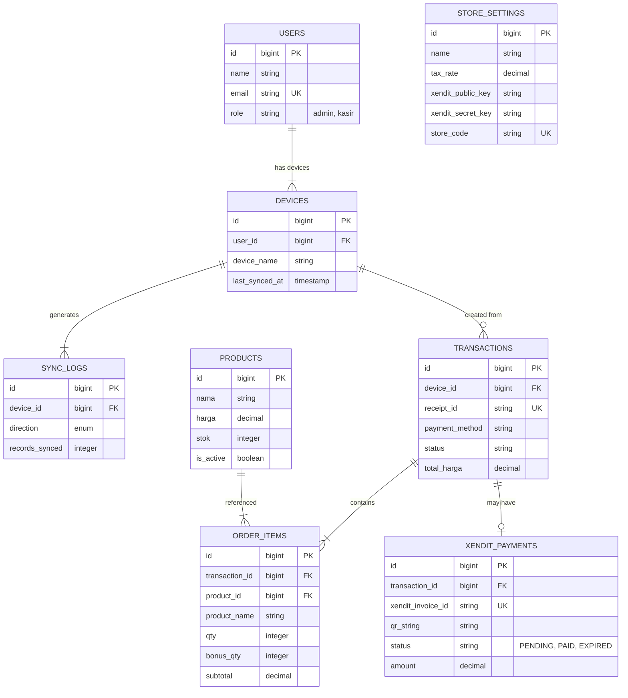
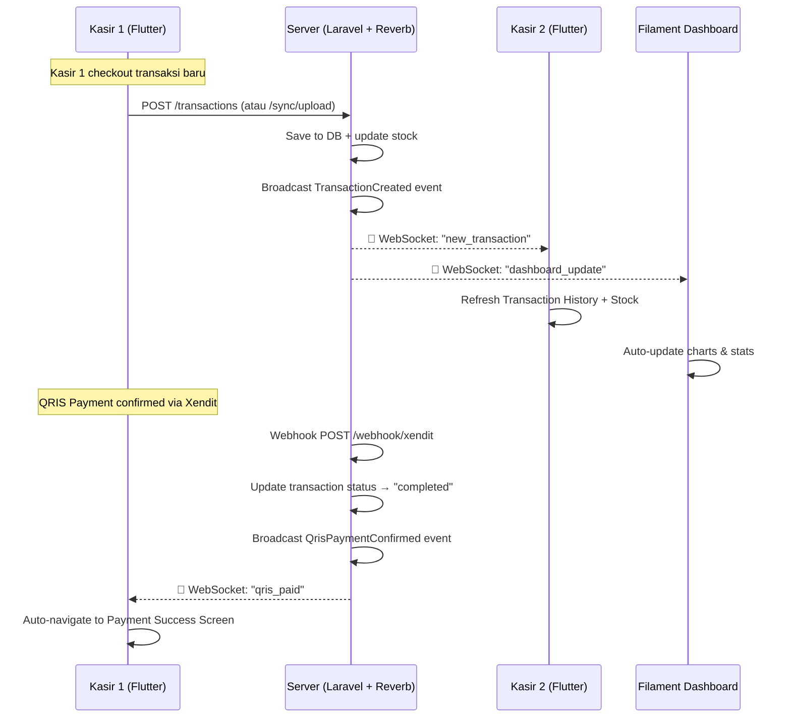
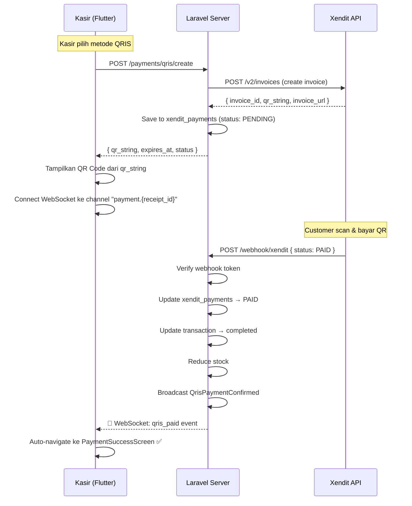

# Arsitektur API Laravel — Precision POS (Distributed)

**Versi:** 2.0  
**Tanggal:** Maret 2026  
**Stack:** Laravel 11 + Filament v3 + Reverb + Xendit ↔ Flutter  
**Arsitektur:** Distributed Multi-Store (1 Server = 1 Store)

---

## 1. Gambaran Besar — Distributed Architecture

Setiap **store** memiliki **server Laravel sendiri** (self-hosted / VPS masing-masing). Ini bukan arsitektur multi-tenant, tetapi arsitektur **terdistribusi** di mana setiap instance berdiri sendiri.

```
╔═══════════════════════════════════════════════════════════════════╗
║                    DISTRIBUTED TOPOLOGY                          ║
╠═══════════════════════════════════════════════════════════════════╣
║                                                                   ║
║  ┌─────────────────────┐    ┌─────────────────────┐              ║
║  │  STORE A — Server   │    │  STORE B — Server   │   ...N       ║
║  │  (VPS / On-premise) │    │  (VPS / On-premise) │              ║
║  │                     │    │                     │              ║
║  │  Laravel + Filament │    │  Laravel + Filament │              ║
║  │  + Reverb + MySQL   │    │  + Reverb + MySQL   │              ║
║  │  + Xendit Webhook   │    │  + Xendit Webhook   │              ║
║  └───────┬─────────────┘    └───────┬─────────────┘              ║
║          │                          │                             ║
║          │  WebSocket (Reverb)      │  WebSocket (Reverb)        ║
║          │  + REST API              │  + REST API                ║
║          │                          │                             ║
║    ┌─────┴─────┐              ┌─────┴─────┐                     ║
║    │ Kasir A-1 │              │ Kasir B-1 │                     ║
║    │ Kasir A-2 │              │ Kasir B-2 │                     ║
║    │ Kasir A-3 │              │ Kasir B-3 │                     ║
║    └───────────┘              └───────────┘                     ║
║    (Flutter Apps)              (Flutter Apps)                    ║
║                                                                   ║
║                       ┌──────────────┐                           ║
║                       │   Xendit     │                           ║
║                       │  (Payment)   │                           ║
║                       └──────┬───────┘                           ║
║                              │ Webhook callback                  ║
║                    ke masing-masing server store                 ║
╚═══════════════════════════════════════════════════════════════════╝
```

### Prinsip Desain

| # | Prinsip | Keterangan |
|---|---------|------------|
| 1 | **1 Server = 1 Store** | Setiap toko deploy Laravel instance sendiri (isolated data) |
| 2 | **Offline-First** | Flutter tetap operasional tanpa internet via sqflite lokal |
| 3 | **Real-Time Sync** | WebSocket via Laravel Reverb — dashboard & kasir lain langsung update |
| 4 | **Xendit QRIS** | QR code payment via Xendit API, konfirmasi via server-side webhook |
| 5 | **Server as Source of Truth** | Saat online, data server menang jika ada konflik |
| 6 | **Sanctum Auth** | Token-based auth per device kasir |

### Keuntungan Distributed vs Multi-Tenant

| Aspek | Distributed (dipilih ✅) | Multi-Tenant |
|-------|--------------------------|--------------|
| Data Isolation | ✅ Total, DB terpisah fisik | Shared DB, row-level |
| Kustomisasi | ✅ Tiap store bisa beda config | Seragam |
| Skalabilitas | ✅ Independen per store | Satu bottleneck |
| Deployment | Per-store (sedikit lebih effort) | Sekali deploy |
| Biaya | VPS per store (~Rp 50-100k/bulan) | Satu server besar |

---

## 2. Arsitektur Detail — Per Server Store

```
┌──────────────────────────────────────────────────────────┐
│                SATU INSTANCE SERVER STORE                  │
│                                                            │
│  ┌─────────────────────────────────────────────────────┐  │
│  │                  Laravel 11                          │  │
│  │                                                      │  │
│  │  ┌───────────┐ ┌──────────┐ ┌────────────────────┐ │  │
│  │  │ Filament  │ │ REST API │ │  Reverb WebSocket  │ │  │
│  │  │ Dashboard │ │ (v1/)    │ │  (Broadcasting)    │ │  │
│  │  │ (Admin)   │ │          │ │                    │ │  │
│  │  └─────┬─────┘ └────┬─────┘ └────────┬───────────┘ │  │
│  │        │             │                │              │  │
│  │  ┌─────┴─────────────┴────────────────┴───────────┐ │  │
│  │  │              Service Layer                      │ │  │
│  │  │  SyncService · AnalyticsService · XenditService │ │  │
│  │  │  StockService · BroadcastService                │ │  │
│  │  └─────────────────────┬───────────────────────────┘ │  │
│  │                        │                              │  │
│  │  ┌─────────────────────┴───────────────────────────┐ │  │
│  │  │              MySQL Database                      │ │  │
│  │  │  users · devices · products · transactions       │ │  │
│  │  │  order_items · xendit_payments · sync_logs       │ │  │
│  │  └─────────────────────────────────────────────────┘ │  │
│  │                                                      │  │
│  │  ┌─────────────────────────────────────────────────┐ │  │
│  │  │  Webhook Endpoint: /webhook/xendit              │ │  │
│  │  │  (Menerima callback pembayaran dari Xendit)     │ │  │
│  │  └─────────────────────────────────────────────────┘ │  │
│  └─────────────────────────────────────────────────────┘  │
└──────────────────────────────────────────────────────────┘
```

---

## 3. Skema Database (Per Instance)

Karena arsitektur distributed (1 server = 1 store), **tidak perlu tabel `stores`** dan **tidak perlu `store_id`** di setiap tabel. Store config cukup di `.env` / table `store_settings`.

### 3.1 Migrasi

#### Tabel `store_settings` (singleton config)
```php
Schema::create('store_settings', function (Blueprint $table) {
    $table->id();
    $table->string('name');                  // Nama toko
    $table->string('address')->nullable();
    $table->string('phone')->nullable();
    $table->string('tax_id')->nullable();    // NPWP
    $table->decimal('tax_rate', 5, 2)->default(8.00);
    $table->string('currency', 3)->default('IDR');
    $table->string('xendit_public_key')->nullable();
    $table->string('xendit_secret_key')->nullable();
    $table->string('xendit_webhook_token')->nullable();
    $table->string('store_code', 10)->unique(); // STORE-A, STORE-B
    $table->timestamps();
});
```

#### Tabel `devices`
```php
Schema::create('devices', function (Blueprint $table) {
    $table->id();
    $table->foreignId('user_id')->constrained()->cascadeOnDelete();
    $table->string('device_name');
    $table->string('platform')->nullable();    // android, ios, web
    $table->timestamp('last_synced_at')->nullable();
    $table->boolean('is_active')->default(true);
    $table->timestamps();
});
```

#### Tabel `products`
```php
Schema::create('products', function (Blueprint $table) {
    $table->id();
    $table->string('nama');
    $table->decimal('harga', 12, 2);
    $table->integer('stok')->default(0);
    $table->string('sku')->nullable();
    $table->string('category')->nullable();
    $table->string('image_url')->nullable();
    $table->boolean('is_active')->default(true);
    $table->timestamps();
    $table->softDeletes();
});
```

#### Tabel `transactions`
```php
Schema::create('transactions', function (Blueprint $table) {
    $table->id();
    $table->foreignId('device_id')->nullable()->constrained()->nullOnDelete();
    $table->string('receipt_id')->unique();
    $table->dateTime('tanggal');
    $table->decimal('subtotal', 12, 2);
    $table->decimal('tax_amount', 12, 2)->default(0);
    $table->decimal('total_harga', 12, 2);
    $table->string('payment_method');       // cash, qris, bon
    $table->string('status');               // completed, pending, void, bon_unpaid, bon_paid
    $table->decimal('received_amount', 12, 2)->nullable();
    $table->decimal('change_amount', 12, 2)->nullable();
    $table->string('customer_name')->nullable();
    $table->string('customer_phone')->nullable();
    $table->date('due_date')->nullable();
    $table->text('notes')->nullable();
    $table->timestamps();
    $table->softDeletes();

    $table->index('tanggal');
    $table->index('status');
    $table->index('payment_method');
});
```

#### Tabel `order_items`
```php
Schema::create('order_items', function (Blueprint $table) {
    $table->id();
    $table->foreignId('transaction_id')->constrained()->cascadeOnDelete();
    $table->foreignId('product_id')->constrained();
    $table->string('product_name');
    $table->decimal('unit_price', 12, 2);
    $table->integer('qty');
    $table->integer('bonus_qty')->default(0);
    $table->decimal('subtotal', 12, 2);
    $table->timestamps();
});
```

#### Tabel `xendit_payments` (khusus QRIS)
```php
Schema::create('xendit_payments', function (Blueprint $table) {
    $table->id();
    $table->foreignId('transaction_id')->constrained()->cascadeOnDelete();
    $table->string('xendit_invoice_id')->unique();
    $table->string('xendit_invoice_url')->nullable();
    $table->string('qr_string')->nullable();       // QR code data dari Xendit
    $table->decimal('amount', 12, 2);
    $table->string('status');                       // PENDING, PAID, EXPIRED
    $table->dateTime('paid_at')->nullable();
    $table->dateTime('expires_at')->nullable();
    $table->json('xendit_response')->nullable();    // raw response
    $table->timestamps();
});
```

#### Tabel `sync_logs`
```php
Schema::create('sync_logs', function (Blueprint $table) {
    $table->id();
    $table->foreignId('device_id')->constrained()->cascadeOnDelete();
    $table->enum('direction', ['upload', 'download']);
    $table->integer('records_synced')->default(0);
    $table->enum('status', ['success', 'partial', 'failed']);
    $table->text('error_message')->nullable();
    $table->timestamps();
});
```

### 3.2 ER Diagram



---

## 4. REST API Endpoints

### 4.1 Base Config

```
Base URL:     https://{store-domain}/api/v1
Auth:         Bearer Token (Laravel Sanctum)
Content-Type: application/json
WebSocket:    wss://{store-domain}/app/{reverb-app-key}
```

### 4.2 Endpoint Map

#### 🔐 Auth

| Method | Endpoint | Deskripsi |
|--------|----------|-----------|
| `POST` | `/auth/login` | Login kasir → return Sanctum token + store info |
| `POST` | `/auth/logout` | Revoke current token |
| `GET` | `/auth/me` | Info user + store settings |
| `POST` | `/auth/register-device` | Daftarkan device baru |

#### 📦 Products

| Method | Endpoint | Deskripsi |
|--------|----------|-----------|
| `GET` | `/products` | List produk aktif |
| `GET` | `/products?updated_since={ISO8601}` | Produk yg berubah (untuk sync) |
| `POST` | `/products` | Tambah produk *(admin only)* |
| `PUT` | `/products/{id}` | Update produk *(admin only)* |
| `DELETE` | `/products/{id}` | Soft delete *(admin only)* |

#### 💳 Transactions

| Method | Endpoint | Deskripsi |
|--------|----------|-----------|
| `GET` | `/transactions` | List paginated + filter (date, status, method) |
| `GET` | `/transactions/{receipt_id}` | Detail + order items |
| `POST` | `/transactions` | Buat transaksi (cash/bon) |
| `PUT` | `/transactions/{receipt_id}/void` | Void + restore stock |
| `PUT` | `/transactions/{receipt_id}/pay-bon` | Tandai bon lunas |

#### 💰 Xendit (QRIS Payment)

| Method | Endpoint | Deskripsi |
|--------|----------|-----------|
| `POST` | `/payments/qris/create` | Buat invoice Xendit + generate QR |
| `GET` | `/payments/qris/{receipt_id}/status` | Cek status pembayaran |
| `POST` | `/webhook/xendit` | *(Public)* Callback dari Xendit saat paid |

#### 🔄 Sync

| Method | Endpoint | Deskripsi |
|--------|----------|-----------|
| `POST` | `/sync/upload` | Bulk upload transaksi offline |
| `GET` | `/sync/download?since={ISO8601}` | Download perubahan server |
| `GET` | `/sync/status` | Cek last sync per device |

#### 📊 Analytics

| Method | Endpoint | Deskripsi |
|--------|----------|-----------|
| `GET` | `/analytics/daily?date={YYYY-MM-DD}` | Ringkasan harian |
| `GET` | `/analytics/hourly?date={YYYY-MM-DD}` | Performa per jam (bar chart) |
| `GET` | `/analytics/summary?period={week\|month}` | Ringkasan periodik |
| `GET` | `/analytics/top-products?limit=10` | Produk terlaris |
| `GET` | `/analytics/bon-report` | Laporan piutang outstanding |

---

### 4.3 Contoh Request & Response

#### POST `/auth/login`

```json
// Request
{ "email": "kasir@tokoa.com", "password": "secret", "device_name": "Samsung A54" }

// Response 200
{
  "token": "1|abc123...",
  "user": { "id": 1, "name": "Kasir 1", "role": "kasir" },
  "store": { "name": "Toko Kopi A", "tax_rate": 8.00, "store_code": "STORE-A" },
  "reverb": {
    "host": "tokoa.pos.id",
    "port": 443,
    "app_key": "reverb-app-key-here"
  }
}
```

#### POST `/payments/qris/create`

```json
// Request
{
  "receipt_id": "INV-20260324-0001",
  "amount": 64800,
  "description": "Order INV-20260324-0001 — 2 items"
}

// Response 200
{
  "xendit_invoice_id": "inv_xnd_abc123",
  "qr_string": "00020101021226680014ID.CO.XENDIT...",
  "invoice_url": "https://checkout.xendit.co/web/inv_xnd_abc123",
  "expires_at": "2026-03-24T09:00:00+08:00",
  "status": "PENDING"
}
```

#### POST `/webhook/xendit` (callback dari Xendit)

```json
// Xendit sends this to your server automatically
{
  "id": "inv_xnd_abc123",
  "external_id": "INV-20260324-0001",
  "status": "PAID",
  "amount": 64800,
  "paid_at": "2026-03-24T08:35:22+08:00",
  "payment_method": "QR_CODE",
  "payment_channel": "QRIS"
}

// Server response 200 → then broadcasts WebSocket event to Flutter
```

#### POST `/sync/upload`

```json
// Request — batch upload offline transactions
{
  "transactions": [
    {
      "receipt_id": "INV-20260324-0001",
      "tanggal": "2026-03-24T08:30:00+08:00",
      "subtotal": 60000,
      "tax_amount": 4800,
      "total_harga": 64800,
      "payment_method": "cash",
      "status": "completed",
      "received_amount": 100000,
      "change_amount": 35200,
      "items": [
        { "product_id": 1, "product_name": "Espresso", "unit_price": 25000, "qty": 1, "bonus_qty": 0, "subtotal": 25000 },
        { "product_id": 3, "product_name": "Cafe Latte", "unit_price": 35000, "qty": 1, "bonus_qty": 0, "subtotal": 35000 }
      ]
    }
  ]
}

// Response 200
{ "synced": 1, "failed": 0, "errors": [], "server_time": "2026-03-24T08:35:00+08:00" }
```

#### GET `/analytics/daily?date=2026-03-24`

```json
{
  "date": "2026-03-24",
  "total_sales": 4820500,
  "total_orders": 142,
  "items_sold": 432,
  "avg_ticket": 33948,
  "payment_breakdown": {
    "cash": { "count": 95, "total": 3200000 },
    "qris": { "count": 38, "total": 1320500 },
    "bon":  { "count": 9,  "total": 300000 }
  },
  "comparison_yesterday": { "sales_change_pct": 12.5 }
}
```

---

## 5. Real-Time dengan Laravel Reverb

### 5.1 Mengapa Reverb?

| Opsi | Keterangan |
|------|------------|
| **Laravel Reverb ✅** | Built-in Laravel, self-hosted, gratis, cocok untuk distributed (tiap store punya Reverb sendiri) |
| Pusher | SaaS, berbayar per koneksi |
| Soketi | Open-source Pusher alternative, tapi Reverb lebih native |

### 5.2 Event yang Harus Di-Broadcast



### 5.3 Laravel Events & Channels

#### Instalasi Reverb
```bash
php artisan install:broadcasting   # Pilih Reverb
php artisan reverb:install
```

#### `.env` Config (per store server)
```env
BROADCAST_CONNECTION=reverb

REVERB_APP_ID=precision-pos
REVERB_APP_KEY=store-a-reverb-key
REVERB_APP_SECRET=store-a-reverb-secret
REVERB_HOST=0.0.0.0
REVERB_PORT=8080
REVERB_SCHEME=https
```

#### Event: TransactionCreated
```php
// app/Events/TransactionCreated.php

class TransactionCreated implements ShouldBroadcast
{
    use Dispatchable, InteractsWithSockets, SerializesModels;

    public function __construct(
        public Transaction $transaction
    ) {}

    public function broadcastOn(): array
    {
        return [
            new PrivateChannel('store.transactions'),
        ];
    }

    public function broadcastWith(): array
    {
        return [
            'receipt_id' => $this->transaction->receipt_id,
            'total_harga' => $this->transaction->total_harga,
            'payment_method' => $this->transaction->payment_method,
            'status' => $this->transaction->status,
            'tanggal' => $this->transaction->tanggal,
        ];
    }
}
```

#### Event: QrisPaymentConfirmed
```php
// app/Events/QrisPaymentConfirmed.php

class QrisPaymentConfirmed implements ShouldBroadcast
{
    public function __construct(
        public Transaction $transaction,
        public XenditPayment $payment,
    ) {}

    public function broadcastOn(): array
    {
        return [
            // Channel specific ke receipt_id, 
            // sehingga hanya kasir yang bersangkutan yang terima
            new PrivateChannel("payment.{$this->transaction->receipt_id}"),
        ];
    }

    public function broadcastWith(): array
    {
        return [
            'receipt_id' => $this->transaction->receipt_id,
            'status' => 'PAID',
            'paid_at' => $this->payment->paid_at,
        ];
    }
}
```

#### Event: StockUpdated
```php
// app/Events/StockUpdated.php

class StockUpdated implements ShouldBroadcast
{
    public function __construct(
        public Product $product
    ) {}

    public function broadcastOn(): array
    {
        return [new PrivateChannel('store.products')];
    }

    public function broadcastWith(): array
    {
        return [
            'product_id' => $this->product->id,
            'nama' => $this->product->nama,
            'stok' => $this->product->stok,
        ];
    }
}
```

#### Channel Authorization
```php
// routes/channels.php

Broadcast::channel('store.transactions', function ($user) {
    return $user !== null;  // Semua user authenticated
});

Broadcast::channel('store.products', function ($user) {
    return $user !== null;
});

Broadcast::channel('payment.{receiptId}', function ($user, $receiptId) {
    // Hanya kasir yang membuat transaksi ini
    return Transaction::where('receipt_id', $receiptId)
        ->whereHas('device', fn ($q) => $q->where('user_id', $user->id))
        ->exists();
});
```

### 5.4 Flutter WebSocket Client

```dart
// lib/services/websocket_service.dart

import 'package:web_socket_channel/web_socket_channel.dart';
import 'dart:convert';

class WebSocketService {
  WebSocketChannel? _channel;
  final String _host;
  final String _appKey;
  final String _token;

  // Callbacks
  Function(Map<String, dynamic>)? onNewTransaction;
  Function(Map<String, dynamic>)? onQrisPaid;
  Function(Map<String, dynamic>)? onStockUpdated;

  WebSocketService({
    required String host,
    required String appKey,
    required String token,
  }) : _host = host, _appKey = appKey, _token = token;

  void connect() {
    final uri = Uri.parse('wss://$_host/app/$_appKey?token=$_token');
    _channel = WebSocketChannel.connect(uri);

    _channel!.stream.listen(
      (message) => _handleMessage(jsonDecode(message)),
      onError: (error) => _reconnect(),
      onDone: () => _reconnect(),
    );

    // Subscribe to channels after connect
    _subscribe('private-store.transactions');
    _subscribe('private-store.products');
  }

  void listenQrisPayment(String receiptId) {
    _subscribe('private-payment.$receiptId');
  }

  void _handleMessage(Map<String, dynamic> data) {
    final event = data['event'];
    final payload = data['data'] is String 
        ? jsonDecode(data['data']) 
        : data['data'];

    switch (event) {
      case 'TransactionCreated':
        onNewTransaction?.call(payload);
        break;
      case 'QrisPaymentConfirmed':
        onQrisPaid?.call(payload);
        break;
      case 'StockUpdated':
        onStockUpdated?.call(payload);
        break;
    }
  }

  void _subscribe(String channel) {
    _channel?.sink.add(jsonEncode({
      'event': 'pusher:subscribe',
      'data': { 'channel': channel, 'auth': _token }
    }));
  }

  void _reconnect() {
    Future.delayed(const Duration(seconds: 3), connect);
  }

  void dispose() => _channel?.sink.close();
}
```

---

## 6. Xendit QRIS Integration

### 6.1 Flow Lengkap



### 6.2 XenditService (Laravel)

```php
// app/Services/XenditService.php

use Illuminate\Support\Facades\Http;

class XenditService
{
    private string $secretKey;
    private string $baseUrl = 'https://api.xendit.co';

    public function __construct()
    {
        $settings = StoreSettings::first();
        $this->secretKey = $settings->xendit_secret_key;
    }

    public function createQrisInvoice(Transaction $transaction): array
    {
        $response = Http::withBasicAuth($this->secretKey, '')
            ->post("{$this->baseUrl}/v2/invoices", [
                'external_id' => $transaction->receipt_id,
                'amount' => $transaction->total_harga,
                'description' => "Order {$transaction->receipt_id}",
                'invoice_duration' => 300,  // 5 menit
                'payment_methods' => ['QR_CODE'],
                'currency' => 'IDR',
                'success_redirect_url' => null,
            ]);

        if (!$response->successful()) {
            throw new \Exception("Xendit API Error: " . $response->body());
        }

        $data = $response->json();

        // Save to local DB
        XenditPayment::create([
            'transaction_id' => $transaction->id,
            'xendit_invoice_id' => $data['id'],
            'xendit_invoice_url' => $data['invoice_url'],
            'qr_string' => $data['qr_string'] ?? null,
            'amount' => $data['amount'],
            'status' => 'PENDING',
            'expires_at' => Carbon::parse($data['expiry_date']),
            'xendit_response' => $data,
        ]);

        return $data;
    }

    public function verifyWebhookToken(string $callbackToken): bool
    {
        $settings = StoreSettings::first();
        return hash_equals($settings->xendit_webhook_token, $callbackToken);
    }
}
```

### 6.3 Webhook Controller

```php
// app/Http/Controllers/Api/V1/XenditWebhookController.php

class XenditWebhookController extends Controller
{
    public function handle(Request $request, XenditService $xenditService)
    {
        // 1. Verify webhook token
        $callbackToken = $request->header('x-callback-token');
        if (!$xenditService->verifyWebhookToken($callbackToken)) {
            return response()->json(['error' => 'Invalid token'], 403);
        }

        // 2. Find payment record
        $xenditId = $request->input('id');
        $payment = XenditPayment::where('xendit_invoice_id', $xenditId)->first();

        if (!$payment) {
            return response()->json(['error' => 'Payment not found'], 404);
        }

        // 3. Update payment status
        $status = $request->input('status'); // PAID, EXPIRED
        $payment->update([
            'status' => $status,
            'paid_at' => $status === 'PAID' ? now() : null,
        ]);

        // 4. If PAID, complete the transaction
        if ($status === 'PAID') {
            $transaction = $payment->transaction;
            $transaction->update(['status' => 'completed']);

            // Reduce stock
            foreach ($transaction->orderItems as $item) {
                $item->product->decrement('stok', $item->qty + $item->bonus_qty);
                event(new StockUpdated($item->product));
            }

            // 5. Broadcast real-time ke Flutter
            event(new QrisPaymentConfirmed($transaction, $payment));
            event(new TransactionCreated($transaction));
        }

        return response()->json(['status' => 'ok']);
    }
}
```

### 6.4 Route Webhook (public, tanpa auth)

```php
// routes/api.php — OUTSIDE auth middleware
Route::post('webhook/xendit', [XenditWebhookController::class, 'handle'])
    ->withoutMiddleware(['auth:sanctum']);
```

---

## 7. Laravel Folder Structure (Lengkap)

```
app/
├── Models/
│   ├── User.php                    [MODIFY] — tambah relasi devices
│   ├── StoreSettings.php           [NEW]
│   ├── Device.php                  [NEW]
│   ├── Product.php                 [NEW]
│   ├── Transaction.php             [NEW]
│   ├── OrderItem.php               [NEW]
│   ├── XenditPayment.php           [NEW]
│   └── SyncLog.php                 [NEW]
│
├── Events/
│   ├── TransactionCreated.php      [NEW] — broadcast saat transaksi baru
│   ├── QrisPaymentConfirmed.php    [NEW] — broadcast saat QRIS paid
│   ├── StockUpdated.php            [NEW] — broadcast saat stok berubah
│   └── TransactionVoided.php       [NEW] — broadcast saat void
│
├── Http/
│   ├── Controllers/Api/V1/
│   │   ├── AuthController.php          [NEW]
│   │   ├── ProductController.php       [NEW]
│   │   ├── TransactionController.php   [NEW]
│   │   ├── SyncController.php          [NEW]
│   │   ├── AnalyticsController.php     [NEW]
│   │   ├── QrisPaymentController.php   [NEW]
│   │   └── XenditWebhookController.php [NEW]
│   ├── Requests/
│   │   ├── LoginRequest.php            [NEW]
│   │   ├── SyncUploadRequest.php       [NEW]
│   │   ├── StoreTransactionRequest.php [NEW]
│   │   └── CreateQrisRequest.php       [NEW]
│   └── Resources/
│       ├── ProductResource.php         [NEW] — API Resource
│       └── TransactionResource.php     [NEW]
│
├── Filament/
│   ├── Resources/
│   │   ├── ProductResource.php         [NEW] — Kelola produk
│   │   ├── TransactionResource.php     [NEW] — View transaksi
│   │   └── DeviceResource.php          [NEW] — Kelola devices
│   ├── Widgets/
│   │   ├── SalesOverviewWidget.php     [NEW]
│   │   ├── HourlyPerformanceChart.php  [NEW]
│   │   ├── PaymentBreakdownWidget.php  [NEW]
│   │   ├── TopProductsWidget.php       [NEW]
│   │   ├── BonReportWidget.php         [NEW]
│   │   └── LiveTransactionFeed.php     [NEW] — Real-time feed
│   └── Pages/
│       ├── AnalyticsDashboard.php      [NEW]
│       └── StoreSettingsPage.php       [NEW]
│
├── Services/
│   ├── SyncService.php                 [NEW]
│   ├── AnalyticsService.php            [NEW]
│   ├── XenditService.php               [NEW]
│   └── StockService.php                [NEW]
│
├── routes/
│   ├── api.php                         [MODIFY]
│   └── channels.php                    [MODIFY]
│
└── config/
    └── reverb.php                      [AUTO] — via install:broadcasting
```

---

## 8. Filament Dashboard Widgets

### 8.1 Daftar Widget

| Widget | Type | Data Source | Real-Time? |
|--------|------|------------|------------|
| `SalesOverviewWidget` | StatsOverview | `AnalyticsService::getDailySummary()` | ✅ Auto-refresh |
| `HourlyPerformanceChart` | ChartWidget | `AnalyticsService::getHourlyPerformance()` | ✅ |
| `PaymentBreakdownWidget` | ChartWidget (Pie) | Payment method breakdown | ✅ |
| `TopProductsWidget` | TableWidget | Top 10 produk by qty sold | polling 30s |
| `BonReportWidget` | TableWidget | Outstanding piutang | polling 60s |
| `LiveTransactionFeed` | Custom Widget | Last 10 transaksi real-time | ✅ WebSocket |

### 8.2 Real-Time di Filament via Alpine.js + Echo

```blade
{{-- resources/views/filament/widgets/live-transaction-feed.blade.php --}}

<x-filament-widgets::widget>
    <x-filament::card>
        <div x-data="{ transactions: @js($transactions) }" 
             x-init="
                Echo.private('store.transactions')
                    .listen('TransactionCreated', (e) => {
                        transactions.unshift(e);
                        if (transactions.length > 10) transactions.pop();
                        $wire.$refresh();
                    });
             ">
            <h3 class="text-lg font-bold mb-4">🔴 Live Transactions</h3>
            <template x-for="tx in transactions" :key="tx.receipt_id">
                <div class="flex justify-between py-2 border-b">
                    <span x-text="tx.receipt_id" class="font-mono text-sm"></span>
                    <span x-text="'Rp ' + tx.total_harga.toLocaleString()" class="font-bold"></span>
                </div>
            </template>
        </div>
    </x-filament::card>
</x-filament-widgets::widget>
```

---

## 9. Flutter Client — Perubahan yang Diperlukan

### 9.1 File Baru

```
lib/
├── services/
│   ├── api_service.dart            [NEW] — HTTP client (dio)
│   ├── auth_service.dart           [NEW] — Login, token storage
│   ├── sync_service.dart           [NEW] — Upload/download logic
│   └── websocket_service.dart      [NEW] — Reverb WebSocket client
├── screens/
│   └── login_screen.dart           [NEW] — Login screen
├── data/
│   ├── database_helper.dart        [MODIFY] — +sync_status, +payment_method, +xendit cols
│   └── api_config.dart             [NEW] — Base URL, Reverb config
├── models/
│   └── transaction_model.dart      [MODIFY] — +payment_method, +sync_status
```

### 9.2 Perubahan Schema sqflite

```dart
// Tambahan pada database_helper.dart - version 2

await db.execute('''
  CREATE TABLE transactions (
    receipt_id TEXT PRIMARY KEY,
    tanggal TEXT NOT NULL,
    total_harga REAL NOT NULL,
    status TEXT NOT NULL,
    payment_method TEXT DEFAULT 'cash',
    sync_status TEXT DEFAULT 'pending',
    synced_at TEXT
  )
''');
```

### 9.3 QRIS Screen — Upgrade ke Xendit Real-Time

```dart
// Perubahan di qris_screen.dart — ganti dummy payment jadi real Xendit

class _QrisScreenState extends State<QrisScreen> {
  final ApiService _api = ApiService();
  final WebSocketService _ws = WebSocketService(/* config */);
  
  String? _qrString;
  String? _invoiceUrl;
  bool _isLoading = true;
  bool _isPaid = false;

  @override
  void initState() {
    super.initState();
    _createQrisPayment();
  }

  Future<void> _createQrisPayment() async {
    final result = await _api.createQrisPayment(
      receiptId: widget.transaction.receiptId,
      amount: widget.transaction.totalHarga,
    );

    setState(() {
      _qrString = result['qr_string'];
      _invoiceUrl = result['invoice_url'];
      _isLoading = false;
    });

    // Listen for real-time payment confirmation via WebSocket
    _ws.listenQrisPayment(widget.transaction.receiptId);
    _ws.onQrisPaid = (data) {
      if (data['status'] == 'PAID') {
        setState(() => _isPaid = true);
        _navigateToSuccess();
      }
    };
  }

  void _navigateToSuccess() {
    Navigator.push(context, MaterialPageRoute(
      builder: (context) => PaymentSuccessScreen(
        transaction: widget.transaction,
        items: widget.items,
        method: 'QRIS',
      ),
    ));
  }

  @override
  void dispose() {
    _ws.dispose();
    super.dispose();
  }
}
```

---

## 10. Deployment — Per Store

### 10.1 Tech Requirements per Server

| Komponen | Minimum | Rekomendasi |
|----------|---------|-------------|
| VPS | 1 vCPU, 1GB RAM | 2 vCPU, 2GB RAM |
| OS | Ubuntu 22.04+ | Ubuntu 24.04 |
| PHP | 8.2+ | 8.3 |
| MySQL | 8.0+ | 8.0 |
| SSL | Let's Encrypt | Let's Encrypt (Certbot) |
| Harga | ~Rp 50k/bulan | ~Rp 100k/bulan |

### 10.2 Setup Script (per store)

```bash
# 1. Clone project
git clone https://github.com/your-org/precision-pos-server.git
cd precision-pos-server

# 2. Install dependencies
composer install --no-dev

# 3. Setup environment
cp .env.example .env
php artisan key:generate

# 4. Configure .env untuk store ini
# DB_DATABASE=pos_store_a
# REVERB_APP_KEY=unique-per-store
# XENDIT credentials per store

# 5. Migrate
php artisan migrate --seed

# 6. Install broadcasting (Reverb)
php artisan reverb:install

# 7. Start services
php artisan serve              # HTTP
php artisan reverb:start       # WebSocket
php artisan queue:work         # Background jobs
```

### 10.3 DNS/Domain Setup

| Store | Domain | Server IP |
|-------|--------|-----------|
| Store A | `store-a.pos.id` | 103.xxx.xxx.1 |
| Store B | `store-b.pos.id` | 103.xxx.xxx.2 |
| Store C | `store-c.pos.id` | 103.xxx.xxx.3 |

Flutter app simpan domain server di login config → setiap kasir tahu server mana yang harus di-connect.

---

## 11. Roadmap Implementasi

### Fase A — Laravel Foundation (1 minggu)

- [ ] Database migrations (7 tabel)
- [ ] Eloquent models + relationships
- [ ] Sanctum auth (login, register-device, token)
- [ ] Store settings config
- [ ] API route group v1

### Fase B — Core API + Sync (1 minggu)

- [ ] ProductController (CRUD)
- [ ] TransactionController (create, void, pay-bon)
- [ ] SyncController + SyncService
- [ ] Request validation (FormRequests)
- [ ] Stock management on transaction save

### Fase C — Reverb Real-Time (3-4 hari)

- [ ] Install & configure Reverb
- [ ] TransactionCreated event
- [ ] StockUpdated event
- [ ] Channel authorization
- [ ] Flutter WebSocket client

### Fase D — Xendit QRIS (3-4 hari)

- [ ] XenditService (create invoice)
- [ ] QrisPaymentController (create, status)
- [ ] XenditWebhookController
- [ ] QrisPaymentConfirmed broadcast event
- [ ] Flutter QRIS screen upgrade (real QR + WebSocket listen)

### Fase E — Filament Analytics (1 minggu)

- [ ] AnalyticsService (daily, hourly, summary, top products)
- [ ] AnalyticsController API endpoints
- [ ] Filament Widgets (Stats, Charts, Tables)
- [ ] Live Transaction Feed widget
- [ ] Custom Dashboard Page
- [ ] CSV Export via Filament

### Fase F — Flutter Integration (1 minggu)

- [ ] ApiService + AuthService
- [ ] Login screen
- [ ] SyncService (background sync)
- [ ] Dashboard & Daily Report → real data dari API
- [ ] WebSocket integration across all screens
- [ ] DB schema migration (v2)

### Fase G — Polish & Deploy (3-4 hari)

- [ ] Error handling + retry logic
- [ ] Offline queue for QRIS fallback
- [ ] Security review (rate limiting, token expiry)
- [ ] First store deployment
- [ ] Documentation & deployment script

---

## 12. Security Checklist

- [ ] Rate limiting: auth = 10/menit, sync = 20/menit, general = 60/menit
- [ ] Xendit webhook verified via `x-callback-token` header
- [ ] All API endpoints behind Sanctum middleware (except webhook)
- [ ] HTTPS enforced (SSL via Let's Encrypt)
- [ ] Token expiry configurable (default 30 hari)
- [ ] Sensitive keys di `.env`, never in code
- [ ] CORS whitelist per store domain
- [ ] Input validation via FormRequest di semua endpoint
- [ ] Soft deletes + audit trail untuk void transactions
