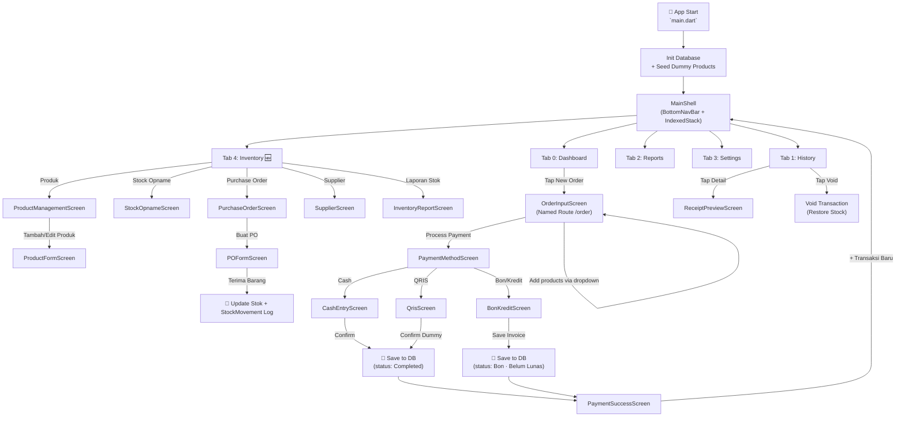
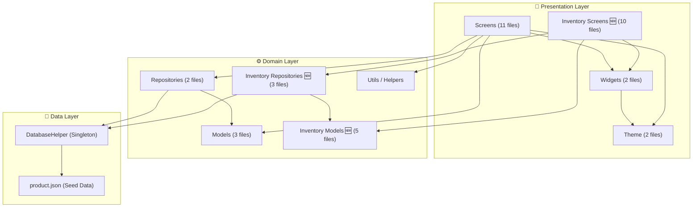
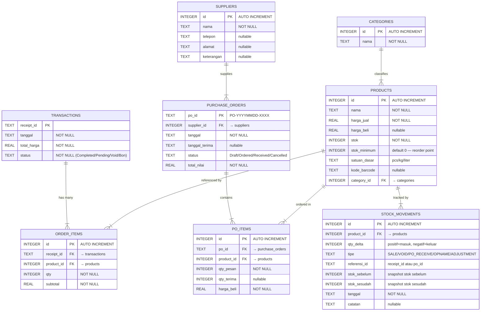
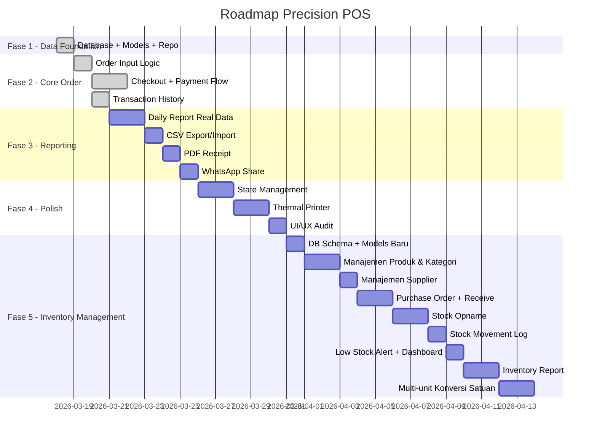
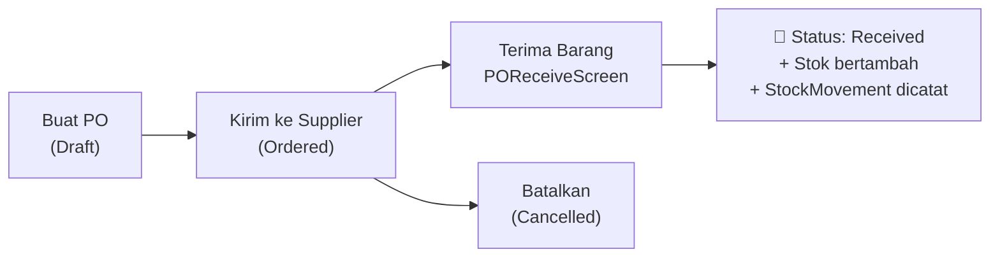

# 📊 Analisis Komprehensif — Precision POS

## 1. Ringkasan Project

**Precision POS** adalah aplikasi Point of Sale (Kasir) berbasis **Flutter** dengan estetika premium "Architectural Layering". Aplikasi ini dirancang **offline-first** menggunakan `sqflite` sebagai database lokal, dan saat ini berada di tahap **MVP (Fase 1–2 sudah selesai, Fase 3–4 belum)**.

| Property | Detail |
|---|---|
| **Framework** | Flutter SDK (Dart 3.11+) |
| **Target** | Android, iOS, Web |
| **Database** | SQLite via `sqflite` |
| **Design System** | Material 3 (Customized) |
| **Typography** | Google Fonts — Inter |
| **Charts** | fl_chart |
| **Status** | Fase 1 ✅ & Fase 2 ✅ selesai · Fase 3, 4, 5 planned |

---

## 2. Daftar Fitur

### ✅ Sudah Diimplementasi

| # | Fitur | Screen | Deskripsi |
|---|---|---|---|
| 1 | **Dashboard** | `dashboard_screen.dart` | Statistik penjualan harian (hardcoded), Quick Actions, Recent Transactions |
| 2 | **Order Input** | `order_input_screen.dart` | Dropdown pilih produk, Qty Reguler + Qty Bonus stepper, kalkulasi subtotal/tax/total real-time |
| 3 | **Pilih Metode Bayar** | `payment_method_screen.dart` | 3 opsi: Cash, QRIS, Bon/Kredit |
| 4 | **Pembayaran Tunai** | `cash_entry_screen.dart` | Input nominal, quick amount, hitung kembalian, simpan transaksi |
| 5 | **Pembayaran QRIS** | `qris_screen.dart` | QR Code dinamis (dari API), simulasi konfirmasi dummy |
| 6 | **Bon/Kredit** | `bon_kredit_screen.dart` | Form data pelanggan, pilih jatuh tempo, simpan sebagai piutang |
| 7 | **Payment Success** | `payment_success_screen.dart` | Resi digital, detail per metode bayar, tombol WhatsApp & Print (belum fungsional) |
| 8 | **Transaction History** | `transaction_history_screen.dart` | List transaksi dari DB, search, grouping by date, void transaksi, lihat detail |
| 9 | **Receipt Preview** | `receipt_preview_screen.dart` | Preview struk lengkap dengan detail item |
| 10 | **Daily Report** | `daily_report_screen.dart` | Grafik bar chart performa per jam, summary cards, transaction table (**data masih hardcoded**) |
| 11 | **Settings** | `settings_screen.dart` | Halaman konfigurasi (Account, Preferences, System — **belum fungsional**) |

### ❌ Belum Diimplementasi (Fase 3, 4 & 5)

| Fitur | Fase | Keterangan |
|---|---|---|
| Daily Report dari data real | 3 | Saat ini masih hardcoded |
| Export CSV | 3 | Tombol ada, fungsi belum |
| Import Data | 3 | Tombol ada, fungsi belum |
| PDF Receipt Generation | 3 | Belum ada |
| WhatsApp Sharing | 3 | Tombol ada, belum fungsional |
| State Management (Provider/Riverpod) | 4 | Belum ada, masih `setState` |
| Thermal Printer Integration | 4 | Belum ada |
| Settings fungsional | 4 | Semua item Settings belum terhubung |
| Manajemen Produk & Kategori | 5 | CRUD produk, kategori, satuan, barcode |
| Stock Opname / Audit Stok | 5 | Rekonsiliasi stok fisik vs sistem |
| Purchase Order (PO) | 5 | Pencatatan pembelian dari supplier |
| Manajemen Supplier | 5 | Data supplier, riwayat pembelian |
| Stock Movement Log | 5 | Jejak masuk/keluar setiap item |
| Low Stock Alert | 5 | Notifikasi produk mendekati reorder point |
| Inventory Report | 5 | Laporan stok, perputaran, margin per produk |
| Multi-unit / Konversi Satuan | 5 | Dus → Lusin → Pcs untuk toko grosir |

---

## 3. Flow Aplikasi



### Flow Detail: Order → Payment

1. User buka **Dashboard** → tap **New Order**
2. Di **OrderInputScreen**: pilih produk dari dropdown, atur qty reguler & bonus
3. Tap **Process Payment** → navigasi ke **PaymentMethodScreen**
4. Pilih metode: **Cash** / **QRIS** / **Bon**
5. Masing-masing screen handle proses pembayaran:
   - **Cash**: Input nominal → hitung kembalian → konfirmasi → save DB
   - **QRIS**: QR Code muncul → dummy confirm → save DB  
   - **Bon**: Isi data pelanggan + jatuh tempo → save DB (status piutang)
6. Semua berakhir di **PaymentSuccessScreen** (resi digital)
7. Dari sana, user bisa memulai transaksi baru (kembali ke Dashboard)

---

## 4. Arsitektur Kode

### 4.1 Struktur Folder

```
precision_pos/lib/
├── main.dart                  # Entry point, App config, MainShell navigation
├── data/
│   └── database_helper.dart   # SQLite init, schema, seed dummy data
├── models/
│   ├── product_model.dart         # Product entity (id, nama, harga, stok, satuan, kategori)
│   ├── transaction_model.dart     # Transaction entity (receipt_id, tanggal, total, status)
│   ├── order_item_model.dart      # Order item entity (receipt_id, product_id, qty, subtotal)
│   ├── supplier_model.dart        # 🆕 Supplier entity (id, nama, telepon, alamat)
│   ├── purchase_order_model.dart  # 🆕 PO entity (po_id, supplier_id, tanggal, status)
│   ├── po_item_model.dart         # 🆕 PO item entity (po_id, product_id, qty, harga_beli)
│   ├── stock_movement_model.dart  # 🆕 Jejak stok (product_id, qty, tipe, referensi, tanggal)
│   └── category_model.dart        # 🆕 Kategori produk (id, nama)
├── repositories/
│   ├── product_repository.dart         # CRUD produk + reduce/restore stock
│   ├── transaction_repository.dart     # Save txn + items, get history, void
│   ├── supplier_repository.dart        # 🆕 CRUD supplier
│   ├── purchase_order_repository.dart  # 🆕 CRUD PO + receive goods
│   └── inventory_repository.dart       # 🆕 Stock opname, movement log, laporan stok
├── utils/
│   └── helpers.dart           # Generate receipt number, PO number, timestamp
├── theme/
│   ├── app_colors.dart        # 40+ design tokens (Material 3 palette)
│   └── app_theme.dart         # ThemeData + full text theme via Google Fonts
├── widgets/
│   ├── top_app_bar.dart       # Reusable top bar (logo, profile avatar)
│   └── bottom_nav_bar.dart    # Custom nav bar with emerald active state
└── screens/
    ├── dashboard_screen.dart               # Tab 0
    ├── transaction_history_screen.dart     # Tab 1
    ├── daily_report_screen.dart            # Tab 2
    ├── settings_screen.dart                # Tab 3
    ├── inventory/                          # 🆕 Tab 4 — Inventory Module
    │   ├── inventory_hub_screen.dart       # 🆕 Landing inventory (quick stats + menu)
    │   ├── product_management_screen.dart  # 🆕 List produk + search + filter kategori
    │   ├── product_form_screen.dart        # 🆕 Add/Edit produk (nama, harga, stok, satuan)
    │   ├── stock_opname_screen.dart        # 🆕 Audit stok fisik vs sistem
    │   ├── purchase_order_screen.dart      # 🆕 List PO (draft, ordered, received)
    │   ├── po_form_screen.dart             # 🆕 Buat/Edit PO + pilih supplier + tambah item
    │   ├── po_receive_screen.dart          # 🆕 Konfirmasi terima barang + update stok
    │   ├── supplier_screen.dart            # 🆕 List & kelola data supplier
    │   ├── stock_movement_screen.dart      # 🆕 Riwayat pergerakan stok per produk
    │   └── inventory_report_screen.dart    # 🆕 Laporan stok, nilai inventaris, top/slow movers
    ├── order_input_screen.dart             # Order flow
    ├── payment_method_screen.dart          # Payment selection
    ├── cash_entry_screen.dart              # Cash payment
    ├── qris_screen.dart                    # QRIS payment
    ├── bon_kredit_screen.dart              # Credit/Bon payment
    ├── payment_success_screen.dart         # Success + digital receipt
    └── receipt_preview_screen.dart         # Receipt detail view
```

### 4.2 Layer Architecture



### 4.3 Database Schema



### 4.4 Navigasi

| Route | Type | Screen |
|---|---|---|
| `/` (home) | Tab 0 | `DashboardScreen` |
| Tab 1 | IndexedStack | `TransactionHistoryScreen` |
| Tab 2 | IndexedStack | `DailyReportScreen` |
| Tab 3 | IndexedStack | `SettingsScreen` |
| Tab 4 🆕 | IndexedStack | `InventoryHubScreen` |
| `/order` | Named Route | `OrderInputScreen` |
| (push) | MaterialPageRoute | `PaymentMethodScreen` → `CashEntry`/`QRIS`/`BonKredit` → `PaymentSuccess` |
| (push) | MaterialPageRoute | `ReceiptPreviewScreen` |
| (push) 🆕 | MaterialPageRoute | `ProductManagementScreen` → `ProductFormScreen` |
| (push) 🆕 | MaterialPageRoute | `PurchaseOrderScreen` → `POFormScreen` → `POReceiveScreen` |
| (push) 🆕 | MaterialPageRoute | `StockOpnameScreen` |
| (push) 🆕 | MaterialPageRoute | `SupplierScreen` |
| (push) 🆕 | MaterialPageRoute | `StockMovementScreen` |
| (push) 🆕 | MaterialPageRoute | `InventoryReportScreen` |

### 4.5 State Management

Saat ini menggunakan **`setState`** murni tanpa state management library. Setiap screen mengelola state-nya sendiri secara lokal. Ini berarti:
- ⚠️ Data **tidak sinkron** antar tab (misal: tambah transaksi di order screen tidak langsung muncul di history/report tanpa refresh manual)
- ⚠️ Tidak ada **global state** untuk cart, user session, dsb.

---

## 5. Design System

### Filosofi "No-Line"
- **Tanpa border 1px** — menggunakan *tonal shifts* (`surfaceContainerLowest` → `surfaceContainerHighest`) dan *ambient shadows*
- **Whitespace** sebagai pemisah visual

### Palette
| Role | Warna | Hex |
|---|---|---|
| Primary (Deep Navy) | 🔵 | `#001E40` |
| Secondary (Emerald) | 🟢 | `#006D36` |
| Emerald Active (Nav) | 💚 | `#50C878` |
| Error | 🔴 | `#BA1A1A` |
| Surface | ⬜ | `#F9F9FE` |

---

## 6. Peta Progress Development



> [!IMPORTANT]
> **Fase 1 & 2** sudah selesai dan berfungsi. **Fase 3** (Reporting, CSV, PDF, WhatsApp), **Fase 4** (State Management, Printer, Final Polish), dan **Fase 5** (Inventory Management) belum dimulai.

---

## 8. Fase 5 — Inventory Management (Detail)

Fase ini dirancang khusus untuk kebutuhan **toko grosir** yang mengelola volume barang besar, banyak SKU, dan pembelian dalam satuan besar (dus, karton, dll).

### 8.1 Fitur Utama

#### 📦 Manajemen Produk & Kategori
- CRUD produk lengkap: nama, harga jual, harga beli, stok, satuan dasar, barcode
- Organisasi produk per **kategori** (Minuman, Sembako, Snack, Rokok, dll)
- Field `harga_beli` untuk kalkulasi margin per produk
- Field `stok_minimum` sebagai **reorder point** — trigger low stock alert
- Scan barcode untuk input cepat (via kamera device)

#### 🏭 Manajemen Supplier
- CRUD data supplier: nama, nomor telepon, alamat, keterangan
- Riwayat PO per supplier untuk analisis vendor performance

#### 📋 Purchase Order (PO)
Flow pembelian barang dari supplier:



| Status PO | Deskripsi |
|---|---|
| `Draft` | PO dibuat, belum dikirim ke supplier |
| `Ordered` | PO sudah dikonfirmasi/dikirim |
| `Received` | Barang sudah diterima, stok terupdate |
| `Cancelled` | PO dibatalkan |

#### 🔍 Stock Opname
Audit rekonsiliasi stok fisik vs stok sistem:
1. User input **qty fisik** tiap produk hasil hitung manual
2. Sistem otomatis hitung **selisih** (fisik - sistem)
3. Konfirmasi → stok sistem disesuaikan → **StockMovement** bertipe `OPNAME` dicatat
4. Laporan hasil opname tersimpan sebagai referensi audit

#### 📈 Stock Movement Log
Setiap perubahan stok — dari manapun — dicatat otomatis:

| Tipe | Trigger | qty_delta |
|---|---|---|
| `SALE` | Transaksi penjualan selesai | negatif |
| `VOID` | Transaksi di-void | positif |
| `PO_RECEIVE` | Terima barang dari PO | positif |
| `OPNAME` | Penyesuaian hasil stock opname | positif/negatif |
| `ADJUSTMENT` | Koreksi manual (rusak, hilang, dll) | positif/negatif |

#### 🔔 Low Stock Alert
- Dashboard menampilkan badge/card peringatan produk yang `stok ≤ stok_minimum`
- InventoryHubScreen menampilkan list produk hampir habis dengan CTA langsung buat PO

#### 📊 Inventory Report
Laporan analitik untuk audit bisnis grosir:

| Laporan | Deskripsi |
|---|---|
| **Nilai Inventaris** | Total nilai stok saat ini (qty × harga_beli) |
| **Margin per Produk** | Selisih harga_jual vs harga_beli per item |
| **Top Mover** | Produk paling banyak terjual dalam periode |
| **Slow Mover** | Produk kurang laku / menumpuk di gudang |
| **Riwayat Pergerakan** | Grafik masuk/keluar stok per produk |

#### 📐 Multi-unit / Konversi Satuan
Fitur kritis untuk toko grosir — satu produk bisa dijual dalam beberapa satuan:

```
Contoh: Indomie Goreng
  Satuan Dasar : Pcs (1 pcs)
  Lusin        : 12 pcs
  Dus          : 40 pcs
```

- Beli dari supplier dalam **Dus** → stok dikonversi ke **Pcs**
- Jual ke pelanggan bisa per **Pcs**, **Lusin**, atau **Dus**
- Harga otomatis menyesuaikan satuan yang dipilih

### 8.2 Screens Baru (Fase 5)

| Screen | File | Deskripsi |
|---|---|---|
| **Inventory Hub** | `inventory_hub_screen.dart` | Landing page: ringkasan stok, low stock alert, quick menu |
| **Product Management** | `product_management_screen.dart` | List produk + search + filter kategori + badge stok kritis |
| **Product Form** | `product_form_screen.dart` | Add/Edit produk lengkap termasuk satuan & barcode |
| **Stock Opname** | `stock_opname_screen.dart` | Input qty fisik, lihat selisih, konfirmasi penyesuaian |
| **Purchase Order** | `purchase_order_screen.dart` | List semua PO dengan filter status |
| **PO Form** | `po_form_screen.dart` | Buat PO baru: pilih supplier, tambah item, set qty & harga beli |
| **PO Receive** | `po_receive_screen.dart` | Konfirmasi terima barang per item, input qty aktual diterima |
| **Supplier** | `supplier_screen.dart` | CRUD supplier + riwayat PO per supplier |
| **Stock Movement** | `stock_movement_screen.dart` | Log pergerakan stok per produk dengan filter tipe & tanggal |
| **Inventory Report** | `inventory_report_screen.dart` | Dashboard analitik: nilai stok, margin, top/slow mover |

### 8.3 Perubahan Database (Migrasi)

Fase 5 membutuhkan **migrasi schema** yang aman terhadap data existing:

```dart
// database_helper.dart — tambah di onUpgrade
Future<void> _onUpgrade(Database db, int oldVersion, int newVersion) async {
  if (oldVersion < 2) {
    // Tambah kolom baru di products (non-breaking, nullable/default)
    await db.execute('ALTER TABLE products ADD COLUMN harga_beli REAL');
    await db.execute('ALTER TABLE products ADD COLUMN stok_minimum INTEGER DEFAULT 0');
    await db.execute('ALTER TABLE products ADD COLUMN satuan_dasar TEXT DEFAULT "pcs"');
    await db.execute('ALTER TABLE products ADD COLUMN kode_barcode TEXT');
    await db.execute('ALTER TABLE products ADD COLUMN category_id INTEGER');

    // Tabel baru
    await db.execute('''CREATE TABLE categories (...)''');
    await db.execute('''CREATE TABLE suppliers (...)''');
    await db.execute('''CREATE TABLE purchase_orders (...)''');
    await db.execute('''CREATE TABLE po_items (...)''');
    await db.execute('''CREATE TABLE stock_movements (...)''');
  }
}
```

> [!WARNING]
> Increment `_databaseVersion` dari `1` ke `2` di `DatabaseHelper` saat mulai Fase 5. Jangan lupa update `onUpgrade` agar data existing (produk, transaksi) tidak terhapus.

### 8.4 Integrasi dengan Fitur Existing

| Titik Integrasi | Perubahan |
|---|---|
| **OrderInputScreen** | Saat transaksi selesai → otomatis catat `StockMovement` tipe `SALE` |
| **Transaction Void** | Saat void → otomatis catat `StockMovement` tipe `VOID` |
| **Dashboard** | Tambahkan widget **Low Stock Alert** jika ada produk di bawah `stok_minimum` |
| **ProductRepository** | Extend method `reduceStock` dan `restoreStock` agar juga insert ke `stock_movements` |

---

## 9. Catatan Teknis & Observasi

> [!NOTE]
> **Kekuatan:**
> - Design system sangat konsisten dan premium (40+ color tokens)
> - Arsitektur Repository pattern sudah baik
> - Support 3 metode pembayaran (Cash, QRIS, Bon/Kredit)
> - Void transaction dengan auto-restore stock sudah berjalan
> - Bonus qty logic yang terpisah dari reguler qty

> [!WARNING]
> **Area yang perlu perbaikan:**
> - **Dashboard data masih hardcoded** (TODAY'S SALES: $4,820.50, TOTAL ORDERS: 142) — tidak terhubung ke DB
> - **Daily Report data hardcoded** — grafik, summary cards, dan tabel transaksi semua dummy
> - **Tidak ada state management** — tiap screen independen, bisa menyebabkan data stale
> - **`CartItem` class** didefinisikan di dalam file screen, bukan di folder models
> - **Receipt di PaymentSuccess** menampilkan `Item ${item.productId}` bukan nama produk
> - **Tax 8% di-hardcode** di OrderInputScreen — tidak bisa dikonfigurasi
> - **Tombol WhatsApp dan Print** di PaymentSuccessScreen belum fungsional
> - **Settings** seluruhnya belum fungsional (UI only)

> [!NOTE]
> **Catatan khusus Fase 5 — Inventory (Grosir):**
> - **`product_model.dart` perlu di-extend** — tambahkan `harga_beli`, `stok_minimum`, `satuan_dasar`, `kode_barcode`, `category_id` sebelum mulai coding screens inventory
> - **`ProductRepository.reduceStock`** harus dimodifikasi agar setiap panggilan juga menyisipkan record ke tabel `stock_movements` — ini kunci auditability
> - **Multi-unit** adalah fitur kompleks — disarankan implementasi terakhir di Fase 5 setelah fitur lain stabil
> - **BottomNavBar** perlu ditambah satu item (Tab 4: Inventory) — perhatikan layout di layar kecil (mungkin perlu switching ke drawer/hamburger menu)
