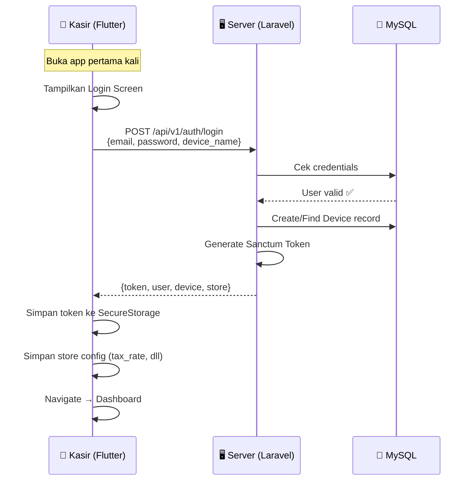
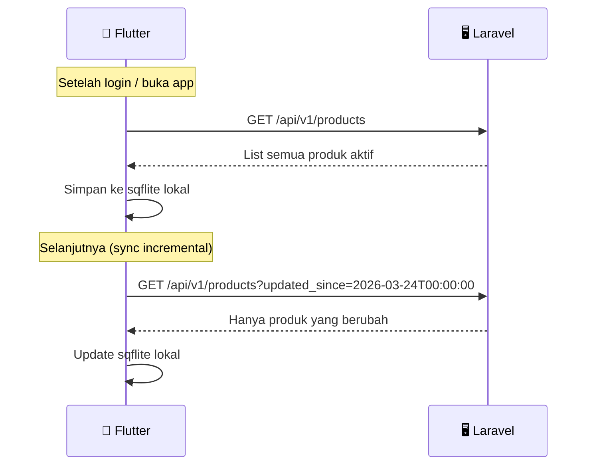
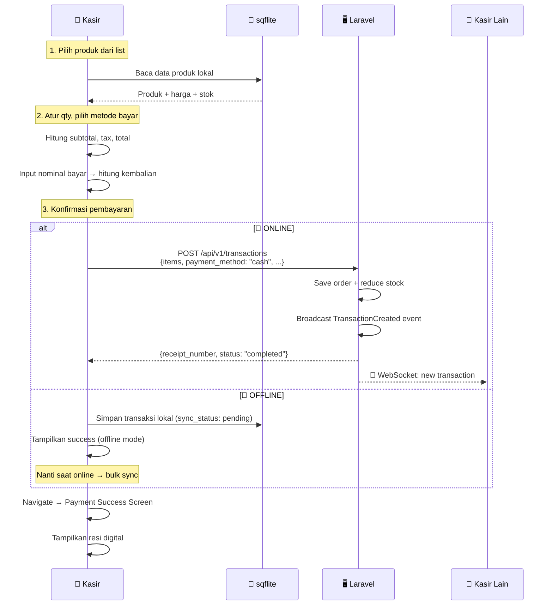
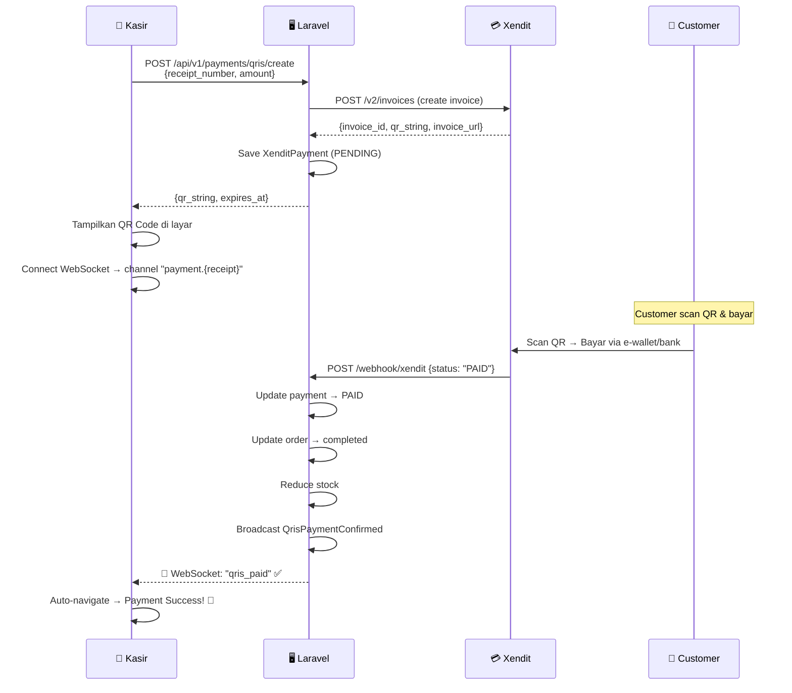
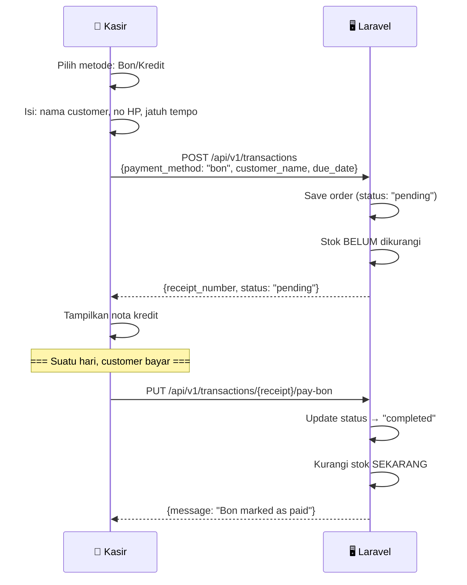
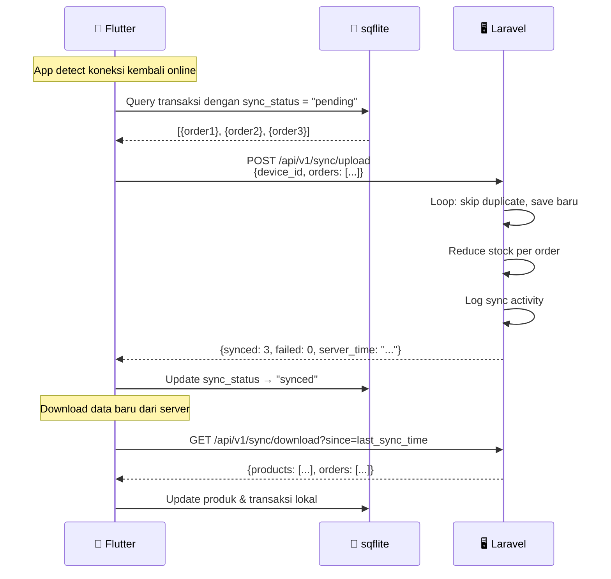
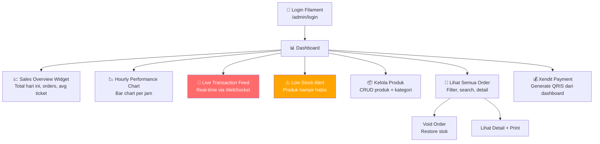
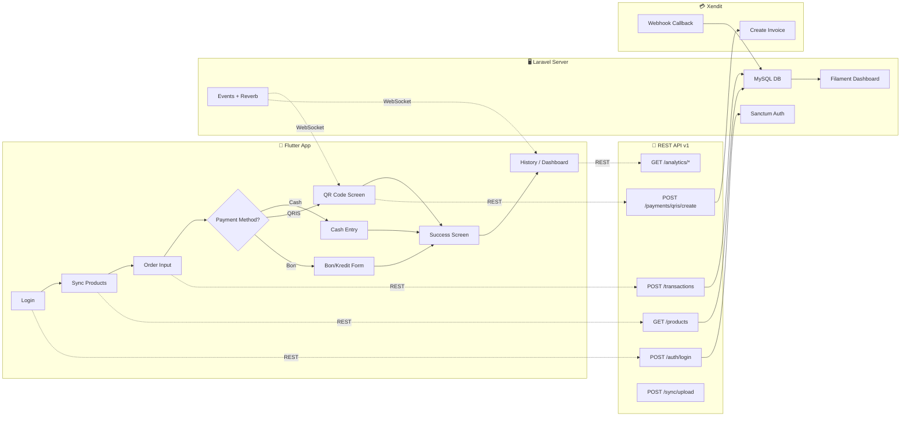

# 🔄 Alur Kerja Laravel + Flutter — Precision POS

## 1. Arsitektur Keseluruhan

```
┌───────────────────────────────────────────────────────────────────┐
│                        ARSITEKTUR SISTEM                          │
│                                                                   │
│   ┌─────────────────────┐         ┌─────────────────────────┐    │
│   │   📱 FLUTTER APP     │  REST   │   🖥️ LARAVEL SERVER      │    │
│   │   (Kasir Mobile)     │◄──API──►│   (Backend + Dashboard)  │    │
│   │                      │         │                          │    │
│   │  • Offline-first     │  WS     │  • Filament Admin Panel  │    │
│   │  • sqflite local DB  │◄──────►│  • REST API v1           │    │
│   │  • UI kasir          │ Reverb  │  • MySQL Database        │    │
│   └─────────┬────────────┘         │  • Xendit Integration    │    │
│             │                      └───────────┬──────────────┘    │
│             │                                  │                   │
│             │         ┌────────────────┐       │                   │
│             └────────►│  💰 XENDIT API  │◄──────┘                   │
│              (QRIS)   │  (Payment)     │  (Webhook)               │
│                       └────────────────┘                           │
└───────────────────────────────────────────────────────────────────┘
```

### Siapa pakai apa?

| Pengguna | Aplikasi | Fungsi |
|----------|----------|--------|
| **Store Manager / Owner** | 🖥️ Laravel Filament (`/admin`) | Kelola produk, lihat laporan, monitor semua kasir |
| **Kasir** | 📱 Flutter App | Input order, proses pembayaran, lihat history |
| **Xendit** | 🔔 Webhook | Konfirmasi pembayaran QRIS otomatis |

---

## 2. User Flow — Kasir (Flutter)

### 2.1 Login & Setup



### 2.2 Sync Produk (Pertama Kali / Refresh)



### 2.3 Buat Transaksi (Cash)



### 2.4 Pembayaran QRIS



### 2.5 Transaksi Bon/Kredit



### 2.6 Sync Offline → Online



---

## 3. User Flow — Store Manager (Filament Dashboard)



---

## 4. Diagram Alur Data Lengkap



---

## 5. Tabel Mapping: Screen Flutter ↔ API Endpoint

| Flutter Screen | API Endpoint | Method | Kapan Dipanggil |
|----------------|-------------|--------|-----------------|
| **Login** | `/auth/login` | POST | Saat user login |
| **Dashboard** | `/analytics/daily` | GET | Saat buka dashboard |
| **Dashboard** | `/analytics/top-products` | GET | Widget top produk |
| **Order Input** | `/products` | GET | Load list produk |
| **Cash Entry** | `/transactions` | POST | Konfirmasi bayar cash |
| **QRIS Screen** | `/payments/qris/create` | POST | Generate QR code |
| **QRIS Screen** | WebSocket `payment.{id}` | WS | Listen konfirmasi bayar |
| **Bon/Kredit** | `/transactions` | POST | Simpan bon |
| **History** | `/transactions` | GET | Load riwayat transaksi |
| **History** | `/transactions/{id}/void` | PUT | Void transaksi |
| **History** | `/transactions/{id}/pay-bon` | PUT | Bayar bon |
| **Daily Report** | `/analytics/daily` | GET | Ringkasan harian |
| **Daily Report** | `/analytics/hourly` | GET | Grafik per jam |
| **Settings** | `/auth/me` | GET | Info user + store |
| **Background** | `/sync/upload` | POST | Sync offline → server |
| **Background** | `/sync/download` | GET | Sync server → lokal |

---

## 6. Offline-First Strategy

```
┌──────────────────────────────────────────────────┐
│                 OFFLINE-FIRST FLOW                │
│                                                    │
│  📶 ONLINE MODE                                   │
│  ┌───────────┐    REST API    ┌──────────────┐   │
│  │  Flutter   │──────────────►│  Laravel API  │   │
│  │  App       │◄──────────────│  (MySQL)      │   │
│  └─────┬─────┘               └──────────────┘   │
│        │                                          │
│        ▼                                          │
│  ┌───────────┐                                    │
│  │  sqflite   │  ← Cache produk & transaksi       │
│  │  (lokal)   │                                    │
│  └───────────┘                                    │
│                                                    │
│  📴 OFFLINE MODE                                  │
│  ┌───────────┐         ❌ No Internet              │
│  │  Flutter   │──────X──────                      │
│  │  App       │                                   │
│  └─────┬─────┘                                    │
│        │                                          │
│        ▼                                          │
│  ┌───────────┐                                    │
│  │  sqflite   │  ← Simpan transaksi offline       │
│  │  (lokal)   │    sync_status = "pending"         │
│  └───────────┘                                    │
│        │                                          │
│        │  Saat online kembali...                   │
│        ▼                                          │
│  POST /sync/upload → Bulk kirim ke server         │
└──────────────────────────────────────────────────┘
```

### Rules Offline:
1. **Produk** → selalu dibaca dari sqflite lokal (di-sync periodik)
2. **Transaksi Cash & Bon** → bisa disimpan offline, sync nanti
3. **Transaksi QRIS** → ❌ TIDAK bisa offline (butuh Xendit API)
4. **Stok** → dikurangi di lokal dulu, server adjust saat sync
5. **Konflik** → Server selalu menang (server as source of truth)
